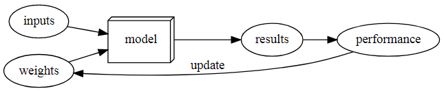

# Questionnaire for Lesson 1

**Q: Do you need these for deep learning?**

- Lots of math
- Lots of data
- Lots of expensive computers
- A PhD

**A:** None of the above is necessary.

**Q: Name five areas where deep learning is now the best in the world.**

**A:** NLP, Computer Vision, Image generation, Playing games, Medicine

**Q: What was the name of the first device that was based on the principle of the artificial neuron?**

**A:** Mark 1 Perceptron

**Q: Based on the book of the same name, what are the requirements for parallel distributed processing (PDP)?**

**A:** Processing units -> State of activation

-> Output function -> Pattern of connectivity

-> Propagation rule -> Activation rule

-> Learning rule -> Environment

**Q: What were the two theoretical misunderstandings that held back the field of neural networks?**

**A:**
1. A single neural network cannot imitate an XOR function.
2. ?

**Q: What is a GPU?**

**A:** Graphics Processing Unit

**Q: Open a notebook and execute a cell containing: `1+1`. What happens?**

**A:** It outputs `2`.

**Q: Follow through each cell of the stripped version of the notebook for this chapter. Before executing each cell, guess what will happen.**

**Q: Complete the Jupyter Notebook online appendix.**

**Q: Why is it hard to use a traditional computer program to recognize images in a photo?**

**A:** There is no straightforward way to describe the steps to the computer for this recognition process.

**Q: What did Samuel mean by "weight assignment"?**

**A:** An input's contribution to the output

**Q: What term do we normally use in deep learning for what Samuel called "weights"?**

**A:** Parameters

**Q: Draw a picture that summarizes Samuel's view of a machine learning model.**

**A:** 

**Q: Why is it hard to understand why a deep learning model makes a particular prediction?**

**A:** Again, its steps are not straightforward. It learns it weights by running through the training set multiple times and measuring its performance on the validation set.

**Q: What is the name of the theorem that shows that a neural network can solve any mathematical problem to any level of accuracy?**

**A:** Universal approximation theorem

**Q: What do you need in order to train a model?**

**A:** Data

**Q: How could a feedback loop impact the rollout of a predictive policing model?**

**A:** Training the model based on previous arrest records predicts arrests rather than predicting actual crimes. Therefore, decisions based on this model might result in more arrests of certain groups of people, further leaning the model's predictions towards them.

**Q: Do we always have to use 224×224-pixel images with the cat recognition model?**

**A:** No, input images are resized automatically under the surface.

**Q: What is the difference between classification and regression?**

**A:** Classification's output is a group of classes, and the model predicts the class of an input. Regression, on the other hand, has a numeric output.

**Q: What is a validation set? What is a test set? Why do we need them?**

**A:** A validation set is a set of data from the same pool as the training set. It is used to measure the success of the model on data that are not used in the training phase. A test set is also not used in the training phase. Its difference from the validation set is that it does not have to belong to the same pool as the training set. Also, it is not used to directly improve the model but mostly to evaluate it.

Not using these results in a blind model that only works well on the training set.

**Q: What will fastai do if you don't provide a validation set?**

**A:** It will use 20 percent of the training set as the validation set.

## Further questions (from the book)

**Q: Can we always use a random sample for a validation set? Why or why not?**

**A:** We can, but in some cases, we shouldn't. One example of this is time series data, where we might be better off making sure the time period of the training set comes before that of the validation set. This way, the model does not see into the future as it is trained.

**Q: What is overfitting? Provide an example.**

**A:** It is when the model performs well only on the training set data.

Example: A model that is trained on recognizing cats with its training set containing images of only black cats, it will have a hard time recognizing cats of other colors.

**Q: What is a metric? How does it differ from "loss"?**

**A:** A metric is a measure of the model's quality, and it is defined for human consumption. On the other hand, loss is the measure of performance used in training the parameters of the model.

**Q: How can pretrained models help?**

**A:** They allow us to have quicker training with less data and time.

**Q: What is the "head" of a model?**

**A:** The last part of the model that is newly added to be specific to the new dataset.

**Q: What kinds of features do the early layers of a CNN find? How about the later layers?**

**A:** Broad patterns (i.e. diagonal, horizontal, and vertical edges)

**Q: Are image models only useful for photos?**

**A:** No. A lot of other data can be represented as images: matrices, sound spectrograms, time series plots...

**Q: What is an "architecture"?**

**A:** The function whose weights are adjusted according to the problem and the desired input->output relationships.

**Q: What is segmentation?**

**A:** Creation of a model that can recognize the content of every individual pixel in an image.

**Q: What is `y_range` used for? When do we need it?**

**A:** It is used for ensuring that the predictions of a model does not exceed user defined limits. We need it when we are sure that values outside of this `y_range` are meaningless in our case.

**Q: What are "hyperparameters"?**

**A:** Higher level parameters impacting the performance of the model without being learned in training. (i.e. learning rate, number of epochs)

**Q: What's the best way to avoid failures when using AI in an organization?**

**A:** In future chapters